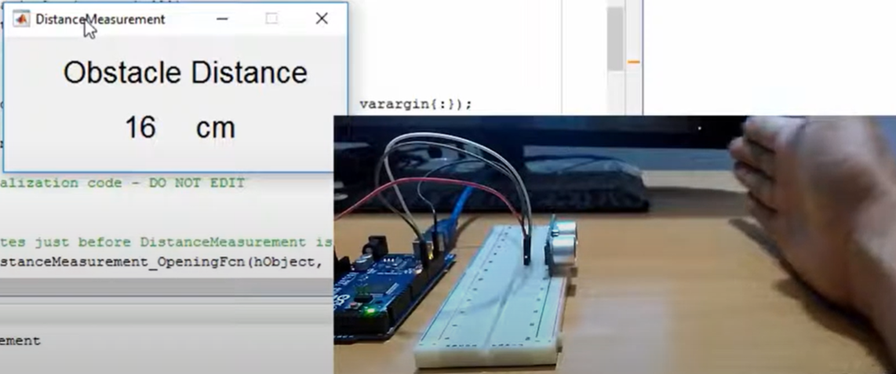

# Distance Measurement Using HC-SR04 Sensor

Ultrasonic Sensor HC-SR04 is widely used by hobbyist for distance measurement. In this repository you will find Arduino Code along with MATLAB and Python codes to display the obstacle distance from the sensor.  

##### MATLAB Example
The following is the user interface with MATLAB.  

[Blog Post Link](https://embeddedlaboratory.blogspot.com/2016/06/ultra-sonic-sensor-interfacing-with.html)  

The following is the YouTube video:  

#### Python Example
The following is the user interface with Python which is developed using PyQt5 framework.  

[YouTube Video Link](https://www.youtube.com/watch?v=XlxUHszMKC0)  
[Blog Post Link](https://embeddedlaboratory.blogspot.com/2017/04/design-gui-in-python-using-pyqt5.html)  
